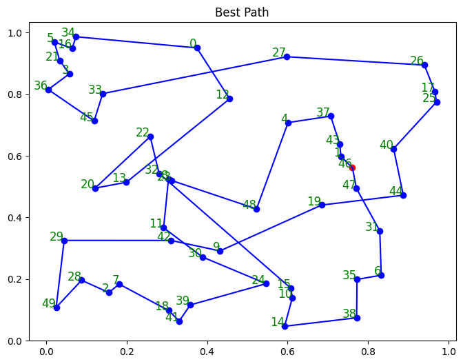

# Cuckoo Algorithm for Solving the Traveling Salesman Problem (TSP)

This Python program uses the Cuckoo algorithm to find an approximate solution to the Traveling Salesman Problem (TSP). The TSP is a classic algorithmic problem focused on optimization, where the goal is to find the shortest possible route that visits a given set of cities and returns to the origin city.

## How It Works

1. **Initialization:** The program initializes a number of "nests" (solutions), which are random permutations of city indices.
2. **Loop:** The main loop runs for a predefined number of iterations. In each iteration, the following steps are taken:

   - **New Solutions Generation:** For each nest, a new solution is generated by swapping two randomly chosen cities.
   - **Nest Replacement:** If the new solution has a shorter total path length (is a better solution) than the current nest, the nest is replaced with the new solution.
   - **Worst Nests Replacement:** A fraction of the worst nests are replaced with new, random solutions.
3. **Best Solution Selection:** After all iterations, the nest with the shortest total path length is chosen as the best solution.

The program uses the Euclidean distance between cities, which are represented as points in a 2D space. The total path length of a solution is the sum of the distances between consecutive cities in the solution.

The main parameters of the program are:

- `num_cities`: The number of cities.
- `num_nests`: The number of nests.
- `max_iter`: The maximum number of iterations.
- `pa`: The fraction of the worst nests to replace in each iteration.

## Output

The program outputs the best found solution, its total path length, and a plot of the cities and the path. The cities are numbered, and the first city in the path is highlighted in red.

## Example

```python
Best path: [1 4 8 13 12 ... 15 3 9 7 1]
Total distance: 12.8754234567
```



---

Remember to replace `plot.png` with the actual path to the image file of your plot. If you're using GitHub, you can include the image in your repository and reference it directly in your `README.md` file.
